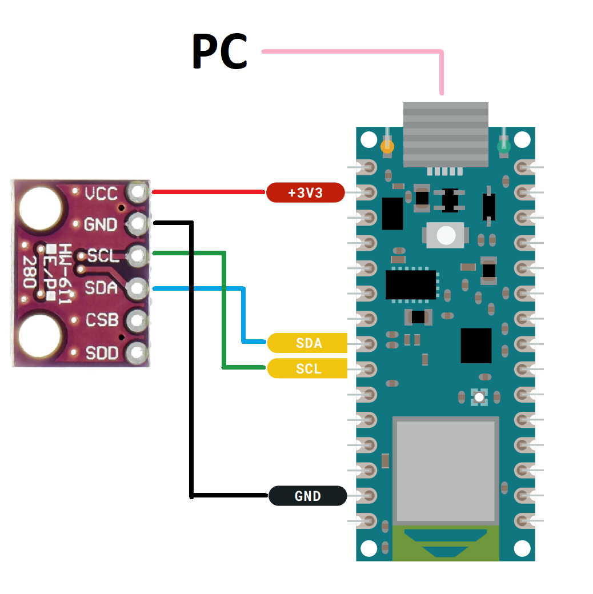
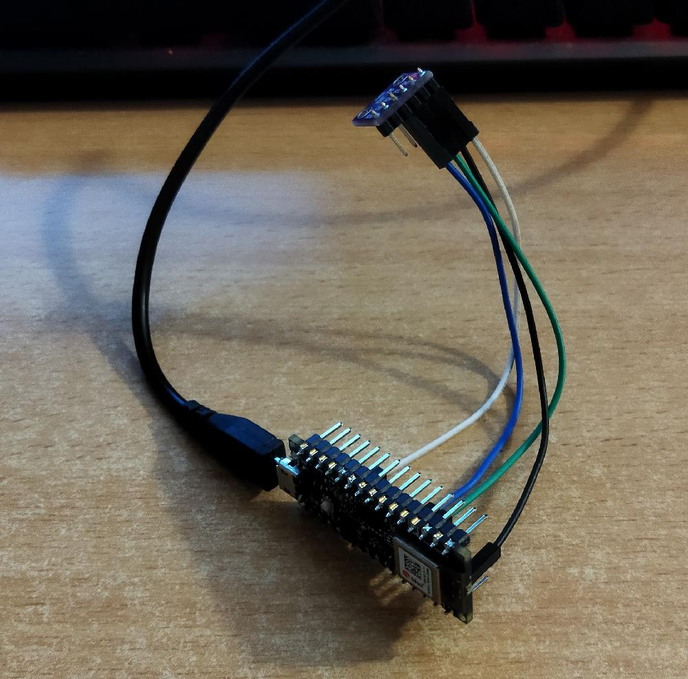
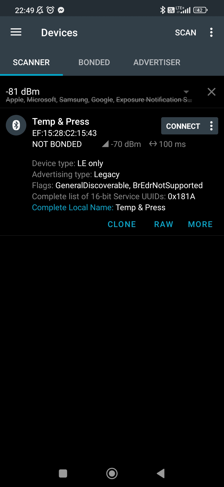
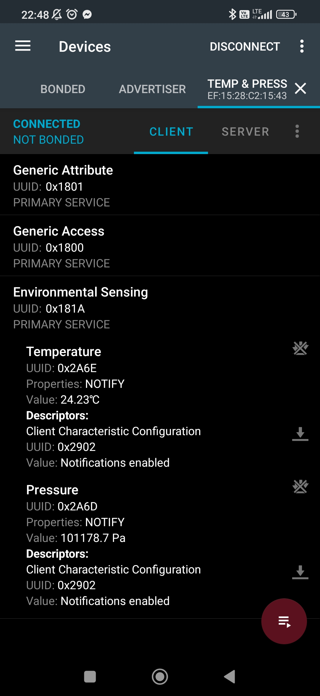

# Zephyr and Arduino - Weather Station

Weather station app based on Zephyr Real-Time Operating System (RTOS) and Arduino Nano 33 BLE prototyping board.

# Authors

Mateusz Matkowski

Mikołaj Starzak

## Achieved Goals

- Measure temperature and pressure with sensors connected to Arduino Nano 33 BLE.
- Use Zephyr system to send data from sensors through the Bluetooth advertisement.
- Read temerature and pressure measurements in nRFconnect android app.

## Used Devices

- Arduino Nano 33 BLE.
- BMP280 - temperature and pressure sensor.
- Android Smartphone.
- PC - flashing Arduino with a USB cable.

## Used Software, Protocols and Technology

- Zephyr - Real-Time Operating System.
- nRF Connect - android app for Bluetooth connection monitoring.
- I2C - communication protocol for connecting BMP280 sensor to the Arduino.
- Bluetooth BLE - Bluetooth Low Energy wireless network.

## Build Zephyr

    west build -p always -b arduino nano 33 ble <path-to-zephyr-root> -DDTC OVERLAY FILE=”arduino i2c.overlay”

## Flash to Arduino Nano 33 BLE

    west flash –bossac=<path-to-bossac> –bossac-port=”COM3”

## Connection Scheme

## Arduino Nano 33 BLE with sensors

## nRFconnect Screenshots

 

